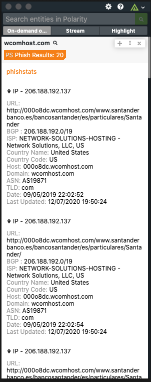

# Polarity PhishStats Integration

PhishStats is known for fighting phishing and cybercrime since 2014 by gathering, enhancing and sharing phishing information with the infosec community.
The PhishStats integration searches the PhishStats API for Domains, URLs, IPs, and SHA256 Hashes for phishing related activity.

To learn more about PhishStats, please visit: https://PhishStats.io/about/

## Installation Instructions

Installation instructions for integrations are provided on the [PolarityIO GitHub Page](https://polarityio.github.io/).

## Polarity

Polarity is a memory-augmentation platform that improves and accelerates analyst decision making.  For more information about the Polarity platform please see:

https://polarity.io/
